# token-stack

**Private, shareable AI coding activity cards for your GitHub README — no server required.**

[](./LICENSE)
[](https://nodejs.org)
[](./package.json)
[](https://www.npmjs.com/package/@sukojin/token-stack)

`token-stack` reads the local JSONL transcripts created by Claude Code, aggregates token usage, and renders animated SVG cards for a GitHub profile, project README, or blog. Your transcripts stay on your machine; only the SVG you choose to publish leaves it.

<p align="center">
  
</p>
<p align="center">
  
  
</p>
<p align="center">
  
  
</p>

## Quick start

```bash
# Create cards in the current directory
npx @sukojin/token-stack generate --card all

# Or create/update a Gist and print README embeds
npx @sukojin/token-stack sync --card all
```

Re-run `sync --gist <id>` to refresh the same public image URL everywhere it is embedded.

Prefer a global install? `npm install --global @sukojin/token-stack`, then use `token-stack` directly.

## Cards

| Card | What it shows |
|---|---|
| `summary` | All-time tokens, estimated API cost, streak, and an order-of-magnitude input/output/cache comparison |
| `activity` | Daily token activity for a selected window |
| `models` | Token share by model |
| `agents` | Token share by coding agent, such as Claude Code and Codex |

Use `--card all` to render every card. SVGs respect `prefers-reduced-motion`; pass `--no-anim` for fully static output.

## README layout guide

Cards have intentional native ratios, so a README can stay balanced instead of becoming a wall of charts.

| Placement | Command | Native size | Best use |
|---|---|---:|---|
| Two-column profile grid | `generate --card summary --compact --chart grass` | 340×200 | Pair with `github-profile-summary-cards` or another compact card |
| Profile hero | `generate --card summary` | 495×250 | One clear all-time headline |
| Full-row activity | `generate --card activity --days 30` | 495×220 | Weekly/monthly momentum |
| Full-row agent mix | `generate --card agents` | 495×150–220 | Claude Code / Codex / Gemini workflow split |
| Model mix companion | `generate --card models` | 495×220 | Place beside activity or agents in a two-column layout |

The gallery above intentionally shows three placements: a 495px hero, a responsive two-column pair, and a
340px compact card. Copy the HTML `width` values when you want a fixed presentation, or use `--scale` when
the raw SVG's intrinsic size needs adjusting.

For compact summary trends, choose `--chart bars` for immediate comparison, `--chart line` for a smoother
trend, or `--chart grass` for a GitHub-style long-term contribution view. Use `--days` to match the story:
`7` for a weekly update, `30` for a monthly profile, and the grass default (17 weeks) for consistency.

All cards are SVGs. `--scale 0.75`, `--scale 1`, and `--scale 1.25` change intrinsic output dimensions
without distorting the ratio, which is useful when a README renderer does not apply a width attribute.

Summary category bars use a logarithmic comparison by default. Cache reads are often orders of magnitude
larger than input/output; log scale keeps every category visible while the labels retain exact values. Pass
`--breakdown raw` when you specifically want proportional raw-token bars.

## Agent distribution

The `agents` card makes a profile reflect how you actually work, not just which model you used. The built-in Claude source is labelled `claude-code`. Add another JSONL-compatible source with an explicit label:

```bash
npx @sukojin/token-stack generate --card agents \
  --agent-source codex:/path/to/codex-usage-jsonl \
  --agent-source gemini:/path/to/gemini-usage-jsonl
```

The explicit path is deliberate: providers can change private local storage formats, and token-stack never guesses at or uploads folders. Extra sources currently need Claude-compatible `message.usage` JSONL records; native provider adapters should be added only with public fixtures and tests.

## Commands

| Command | What it does |
|---|---|
| `generate` | Write SVG card(s) to disk (default) |
| `sync` | Upload card(s) to a Gist via `gh` and print embed links |
| `stats` | Print a usage summary to the terminal |
| `json` | Print aggregated statistics for another frontend |
| `init` | Print a reviewable Claude Code hook and README embed; changes no settings |

## Options

| Flag | Default | Notes |
|---|---|---|
| `--card` | `summary` | `summary`, `activity`, `models`, `agents`, or `all` |
| `--compact` | | 340×200 summary card |
| `--chart` | `bars` | Compact trend: `bars`, `line`, or `grass` |
| `--breakdown` | `log` | Summary comparison: `log` (readable) or `raw` (proportional tokens) |
| `--theme` | `dark` | `dark`, `light`, `dracula`, or `tokyonight` |
| `--days` | `30` | Activity-chart window |
| `--scale` | `1` | Intrinsic SVG scale from `0.25` to `3`, preserving ratio |
| `--no-anim` | | Render static cards |
| `--source` | `~/.claude/projects` | Primary Claude Code data directory |
| `--agent-source` | | Extra `name:directory` JSONL source; repeatable |
| `--privacy` | `public` | `private` removes project names from JSON output |
| `--gist` | | Existing Gist ID to update in place |
| `--public` | | Make a newly-created Gist public; default is secret |

## Keep cards fresh

Run this once to get a safe, copyable setup snippet:

```bash
npx @sukojin/token-stack init --gist YOUR_GIST_ID
```

It prints a Claude Code `SessionEnd` hook that runs `token-stack sync`. Review and add it to your `~/.claude/settings.json`, or schedule the same command with Task Scheduler / cron.

## History and costs

Claude Code may delete old transcripts. token-stack stores a small per-day snapshot at `~/.token-stack/history.json` so all-time values continue growing. It contains aggregate token counts, not messages. Writes are atomic.

Costs are API-price estimates, not subscription charges. If you use Pro or Max, treat them as a comparable usage metric rather than an invoice.

## Development and releases

```bash
npm test
npm pack --dry-run
```

Push a `v*` tag to publish a release. The workflow runs tests and publishes `@sukojin/token-stack` with the repository `NPM_TOKEN` secret; it safely skips publishing when the secret is absent.

## Requirements

- Node.js 18+
- [GitHub CLI](https://cli.github.com) with `gh auth login` for `sync`
- Claude Code local sessions for the built-in source

## License

MIT
